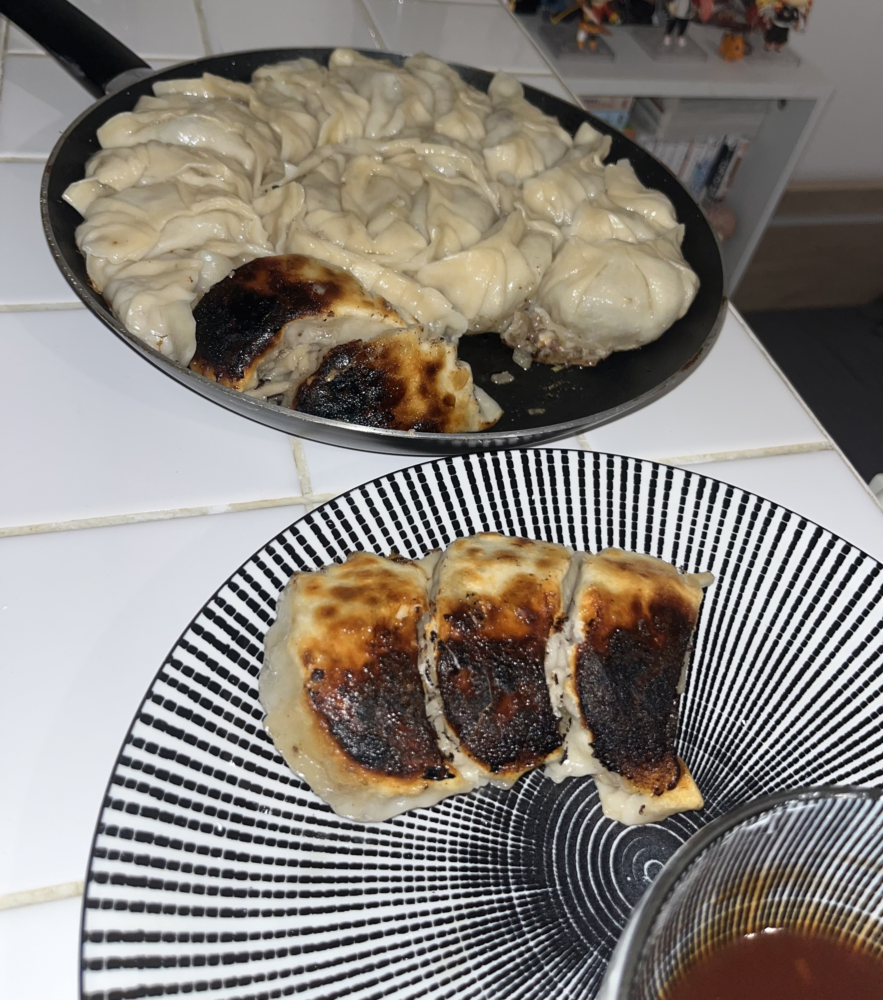

[ACCUEIL🏠](index.md) | [LASAGNES🍝](lasagnes.md) | [NUGGETS🍗](nuggets.md) | [TENDERS🍗](tenders.md) | [TARTIFLETTE🧀](tartiflette.md) | [ESCALOPE JURASSIENNE🥩](escalope.md) | [GYOZAS🥟](gyozas.md)

# GYOZAS



## Ingrédients: (22 gyozas)
* Farine
* Maïzena
* 400g ~~200g~~ de bœuf haché
* ½ poireau ~~1 poireaux~~
* 1 gros oignon
* 4 gousses d’ail
* Sauce soja sucrée
* Huile de sésame grillé
* Sel / Poivre / Paprika

## Préparation
**Étape 1: Pâte à gyozas**
> Dans un saladier, ajoutez 350g de farine, puis ajoutez 1 verre d’eau tiède. Mélangez le tout à la main jusqu’à ce que vous obteniez une boule de pâte plus ou moins élastique (si vous voyez que votre pâte n’a pas une bonne texture, vous pouvez ajouter de la farine ou de l’eau en conséquence). Malaxez votre pâte pendant 5 minutes, puis laissez reposer 30 minutes dans le saladier recouvert d’un torchon sec.


**Étape 2: Farce à gyozas**
> Émincez 1 oignon, ½ poireau ~~1 poireau~~ (après avoir tester cette recette, j’ai trouvé que le ratio viande/poireaux n’était pas à mon goût). Dans un saladier, déposez vos 400g ~~200g~~ de bœuf haché, ajoutez 4 gousses d’ail hachées, 2 cuillères à soupe de sauce soja sucrée, 1 cuillère à soupe d’huile de sésame grillé, du sel, du poivre et du paprika. Mélangez le tout. Ajoutez dans le saladier l’oignon et le poireau émincé. Mélangez le tout pour que les ingrédients de la farce soient uniformément répartis. Mettez ce saladier au frigo.


**Étape 3: Confection des gyozas**
> Prenez votre pâte et créez des petites boules de pâte d’environ 2,5 cm de diamètre. Sur votre plan de travail, déposez de la maïzena et préparez un petit bol d’eau. Prenez 1 petite boule de pâte, trempez-la dans le bol d’eau, puis roulez-la dans de la maïzena. Munissez-vous d’un rouleau à pâtisserie ou d’un objet cylindrique si vous n'en avez pas. Aplatissez votre petite boule de pâte finement pour qu’elle forme un disque d’environ 10 centimètres de diamètre (vous pouvez utiliser un emporte-pièce pour découper un cercle dans votre disque si celui-ci n’est pas suffisamment circulaire). Frottez votre disque de pâte avec de la maïzena et déposez-le sur une assiette. Répétez ce processus avec toutes vos boules de pâtes (j’ai pu en faire 22). Passons maintenant à la confection des gyozas. Avant tout, prenez une grande poêle et badigeonnez celle-ci d’un peu d’huile de tournesol (ou autre huile végétale). Prenez 1 disque de pâte, et avec l’aide d’un pinceau, mouillez le bord de votre disque (environ 1 cm de large). Déposez 1 bonne cuillère de farce au centre du disque. Pliez la pâte en 2 et appuyez au centre, ensuite, faites 3 plis de chaque côté. Placez le gyoza dans la poêle précédemment huilée. Répétez jusqu’à ce qu’il ne vous reste plus de pâte ni de farce.


**Étape 4: Cuisson des gyozas**
> Mettez votre poêle sur le feu à feu moyen et laissez colorer 5 minutes. Une fois ces 5 minutes écoulées, versez de l’eau à mi-hauteur des gyozas et couvrez, puis laissez cuire 7 minutes. Ensuite, enlevez le couvercle, passez à feu fort et laissez l’eau s’évaporer pendant 2 minutes. Après, ajoutez 2 cuillères à soupe d’huile de sésame grillé que vous répartirez uniformément sur tous les gyozas. Laissez sur le feu encore 6 à 7 minutes pour caraméliser et légèrement cramer le dessous des gyozas. Ensuite, retirez la poêle du feu pour laisser refroidir quelques instants (ne surtout pas couvrir au risque de perdre le croustillant des gyozas). Et voilà c’est prêt! Il ne vous reste plus qu’à vous régaler avec vos gyozas que vous pouvez tremper dans la sauce de votre choix!

***

### Avis dégustation en avant-première:
> ```Oceren DasSaveurs:```
>> "J'ai goûté les gyozas JojoCooking! Ils étaient excellents, très bien pliés et la farce se mêle parfaitement avec un peu de riz et de sauce ! Itadakimasu! 😋" 
