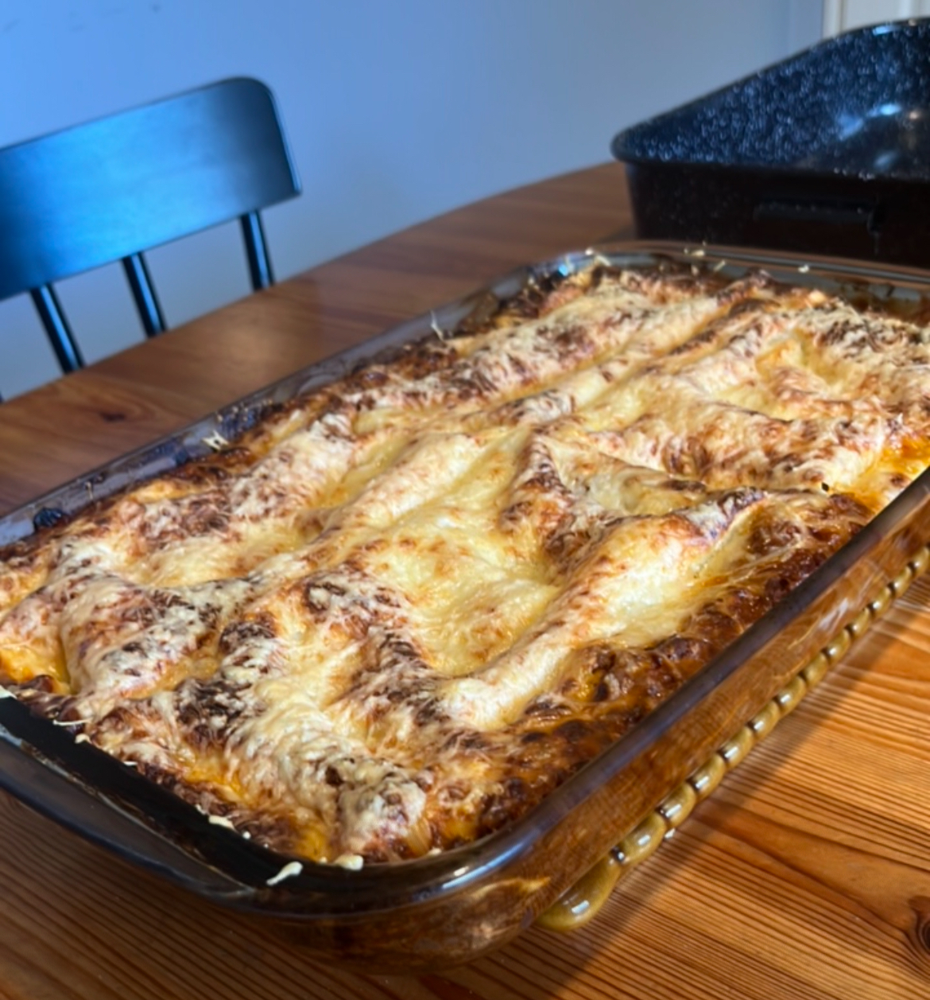

[ACCUEIL🏠](index.md) | [LASAGNES🍝](lasagnes.md) | [NUGGETS🍗](nuggets.md) | [TENDERS🍗](tenders.md) | [TARTIFLETTE🧀](tartiflette.md) | [ESCALOPE JURASSIENNE🥩](escalope.md) | [GYOZAS🥟](gyozas.md)

### Ingrédients: (4 personnes)
* 400g de bœuf haché
* Pâtes à lasagnes crues
* 400 ml de sauce tomate (2 briques)
* 300 g de béchamel (1 brique et demi)
* 2 oignons
* 3 gousses d’ail
* 100 g de parmesan
* 100 g de fromage râpé
* Ketchup
* Sel / Poivre / Paprika

### Préparation:
**Étape 1: Préparation de la bolognaise**
> Emincez 2 oignons et faites les revenir dans une poêle avec du beurre salé pendant 5 bonnes minutes à feu moyen. Une fois qu’ils commencent à colorer, ajoutez-y 3 gousses d’ail hachés. Mélangez le tout et laissez 2 minutes supplémentaires. Dans la même poêle, ajoutez les 400g de viande hachée, ajoutez sel, poivre et paprika (optionnel) et laissez cuire. Une fois qu’on ne voit plus le rouge de la viande, laissez s’évaporer l’eau de la viande (car oui, il y a toujours une bonne dose d’eau dans la viande…). Ensuite, ajoutez les 400ml de sauce tomate ainsi que 2 cuillères à soupe de ketchup (pour donner un petit goût sucré à la sauce). Baissez à feu doux, puis laissez sur le feu quelques instants le temps que les saveurs imprègnent la sauce.

**Étape 2: Assemblage**
> Dans votre plat à four, déposez 2 cuillères à soupe de béchamel, et répartissez celle-ci sur tout le fond, ainsi que sur les parois du plat. Après la béchamel, disposez les pâtes à lasagnes uniformément. Ensuite, ajoutez un quart de la sauce bolognaise. Étalez un peu de béchamel par-dessus la sauce, et saupoudrez d’une bonne dose de parmesan. Disposez de nouveau les pâtes et répétez le processus jusqu’à ce que vous soyez à court de sauce bolognaise. Sur la dernière couche de bolognaise, ajoutez des pâtes à lasagne, versez ce qu’il vous reste de béchamel, ajoutez ce qu’il vous reste de parmesan, et pour finir ajoutez le fromage râpé uniformément.

**Étape 3: Cuisson**
> Dans un four préchauffé à 180°C, enfournez votre plat pendant 1 heure. Une fois le temps écoulé, sortez le plat du four, et y’a plus qu’à déguster!
