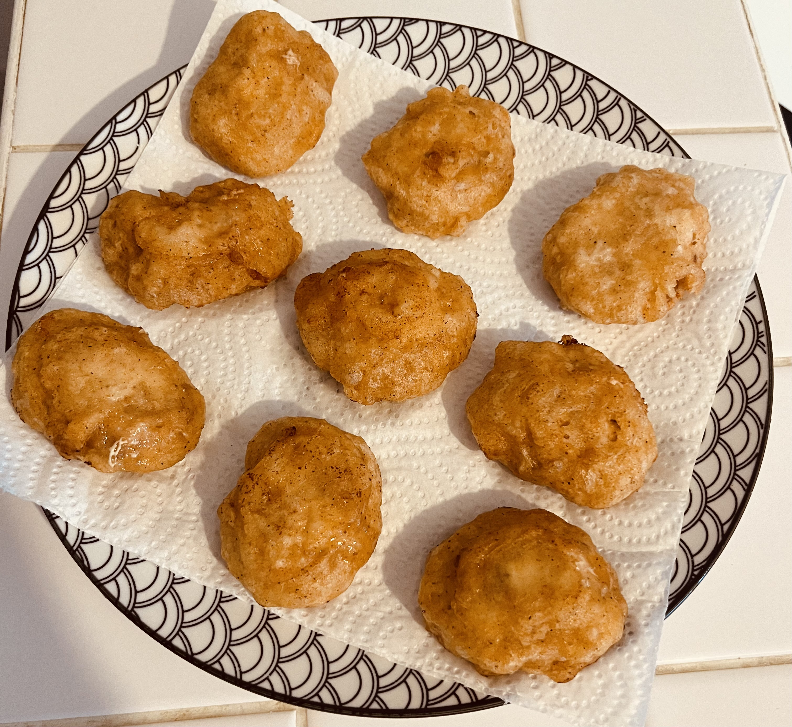

[ACCUEIL🏠](index.md) | [LASAGNES🍝](lasagnes.md) | [NUGGETS🍗](nuggets.md) | [TENDERS🍗](tenders.md) | [TARTIFLETTE🧀](tartiflette.md) | [ESCALOPE JURASSIENNE🥩](escalope.md) | [GYOZAS🥟](gyozas.md)

# NUGGETS

## `Ingrédients: (12 nuggets)`
* 2 filets de poulet (environ 300 g)
* Farine
* Maïzena
* Eau gazeuse
* Sel / Poivre / Paprika / Piment

***

## `Préparation:`
**Étape 1: Confection des nuggets**
> Pour confectionner de délicieux nuggets, on va commencer par hacher finement notre poulet (_vous pouvez utiliser un mixeur pour aller plus vite, mais utiliser un couteau fera l’affaire_). Assaisonnez votre haché de poulet avec sel, poivre, paprika et piment (_ajoutez-en selon vos goûts_). Confectionnez vos nuggets en prenant une petite boule de la mixture d’environ 3cm de diamètre, puis aplatissez-la un peu pour lui donner une jolie forme (_vous devriez pouvoir faire une douzaine de nuggets_). Déposez vos nuggets sur un plat recouvert de papier sulfurisé, et mettez-les au congélateur pendant 30 minutes (_ce qui les rendra plus faciles à manipuler_).

**Étape 2: Cuisson des nuggets**
> Après ces 30 minutes, sortez vos nuggets et recouvrez-les de farine. Dans un récipient, ajoutez 150 g de farine, 3 cuillères à café de maïzena, ainsi que les mêmes épices que vous avez utilisées pour assaisonner le poulet. Ajoutez dans ce même récipient de l’eau gazeuse petit à petit, puis mélangez jusqu’à obtenir une texture de pâte à beignets (_ni trop liquide, ni trop épaisse_). C’est maintenant le tour de la cuisson! Enduisez vos nuggets recouverts de farine dans la mixture, et plongez-les dans une huile bien chaude (_180°C, l’équivalent d’un feu moyen_) et cuisez-les pendant 8 minutes en tout. Pensez à retourner les nuggets plusieurs fois durant la cuisson pour avoir une coloration uniforme. Une fois cuits, égouttez-les et placez-les sur une grille ou sur du papier absorbant. Attendez un peu qu’ils refroidissent légèrement, et plus qu’à déguster avec votre sauce préférée!
