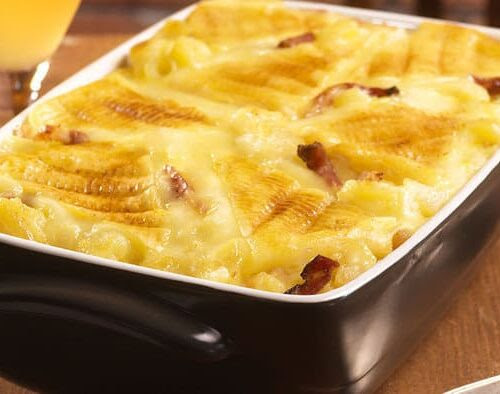

[ACCUEIL🏠](index.md) | [LASAGNES🍝](lasagnes.md) | [NUGGETS🍗](nuggets.md) | [TENDERS🍗](tenders.md) | [TARTIFLETTE🧀](tartiflette.md) | [ESCALOPE JURASSIENNE🥩](escalope.md) | [GYOZAS🥟](gyozas.md)

# TARTIFLETTE

## `Ingrédients: (4 personnes)`
* 1 reblochon (environ 500g)
* 1kg de pommes de terre
* 200 g d'allumettes de lardons fumées
* 2 oignons
* 1 brique de crème semi-épaisse (20 cl)
* Sel / Poivre

***

## `Préparation:`
**Étape 1: Préparer tous les éléments**
> Pour préparer cette tartiflette on va commencer par éplucher les pommes de terre, les couper en morceaux assez grossiers, puis les plonger dans l’eau bouillante salée pendant une quinzaine de minutes. Pendant ce temps, émincez les 2 oignons et faites les revenir dans une poêle avec une noisette de beurre salé pendant 5 bonnes minutes à feu moyen pour qu’ils colorent légèrement. Une fois que les oignons sont bien colorés, ajoutez-y les allumettes, ajoutez un peu de poivre (_à votre convenance_) et laissez cuire encore 5 minutes. Une fois que tout est bien coloré, ajoutez 1 brique de crème dans la poêle, et laissez infuser pendant 5 minutes. À ce stade, vos pommes de terre devraient être prêtes! Égouttez-les et placez-les dans un plat adapté pour aller au four. Versez la crème aux oignons et allumettes sur les pommes de terre et mélangez un peu pour répartir uniformément la mixture. Coupez votre reblochon en 2 dans le sens de l’épaisseur et déposez les 2 morceaux sur le dessus de votre plat. 

**Étape 2: Cuisson**
> Préchauffez le four à 200°C. Enfournez pendant une vingtaine de minutes le temps que le reblochon dore. Une fois que sa couleur vous plaît, sortez le plat du four, et y’a plus qu’à déguster!
