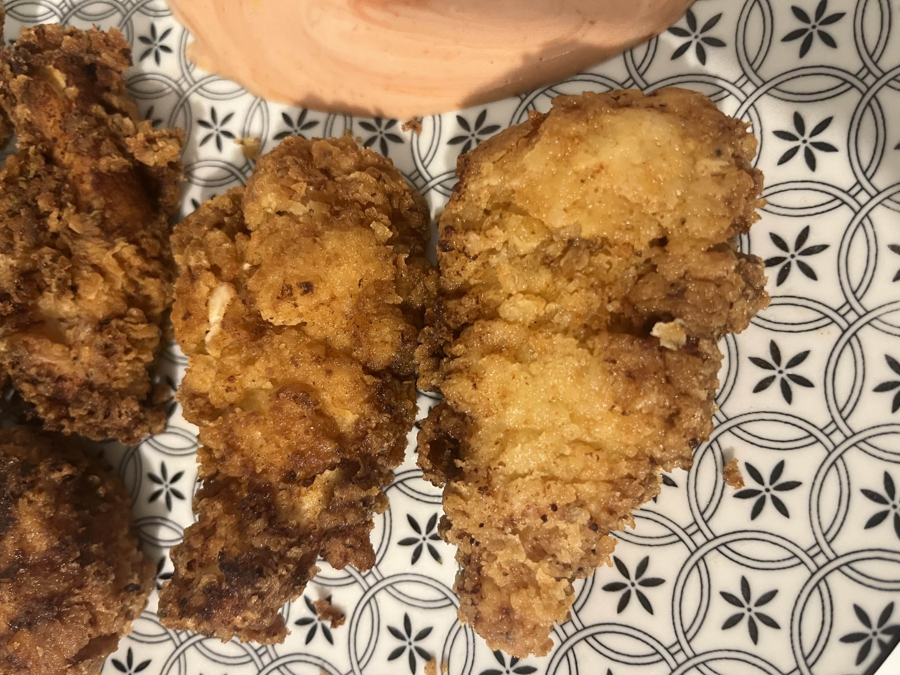

[ACCUEIL🏠](index.md) | [LASAGNES🍝](lasagnes.md) | [NUGGETS🍗](nuggets.md) | [TENDERS🍗](tenders.md) | [TARTIFLETTE🧀](tartiflette.md) | [ESCALOPE JURASSIENNE🥩](escalope.md) | [GYOZAS🥟](gyozas.md)

# TENDERS

## Ingrédients: (6 tenders)
* 6 aiguillettes de poulet
* 1 brique de crème semi-épaisse (20 cl)
* Farine
* Sel / Poivre / Piment / Paprika / Tabasco

## Préparation:
**Étape 1: Préparation de la marinade**
> Dans un récipient, versez une brique de crème, ajoutez sel, poivre, piment, paprika et quelques gouttes de tabasco (optionnel si vous n'aimez pas le piquant), et mélangez. Vous pouvez mettre directement vos aiguillettes dans le récipient, mais si comme moi vous êtes pointilleux et que surtout vous détestez trouver un nerf dans votre viande, vous pouvez enlever celui des aiguillettes. Sur vos aiguillettes il y a un petit bout du nerf blanc qui dépasse, prenez une fourchette et glissez-y ce bout entre les dents de celle-ci, prenez un sopalin pour pas que ça glisse, et tirez dessus et faites glisser la fourchette le long du nerf. Mettez votre poulet dans la crème et faites en sorte qu’elle recouvre tout votre poulet. Couvrez de papier aluminium et laissez au frigo pendant 3 bonnes heures.

**Étape 2: Cuisson**
> Sortez votre poulet du frigo. Prenez un autre récipient et mettez-y de la farine. Avec l’aide d’une fourchette, prenez une aiguillette, trempez-la dans la farine, trempez-la de nouveau dans la crème, et de nouveau dans la farine, puis plongez-la dans de l’huile bien chaude (180°C, l’équivalent d’un feu moyen). Laissez-les cuire une dizaine de minutes jusqu’à ce qu’elles soient bien colorées. Une fois bien cuites, sortez-les et laissez égoutter sur une plaque ou sur du papier absorbant. Attendez que ça refroidisse un peu et y’a plus qu’à déguster!
